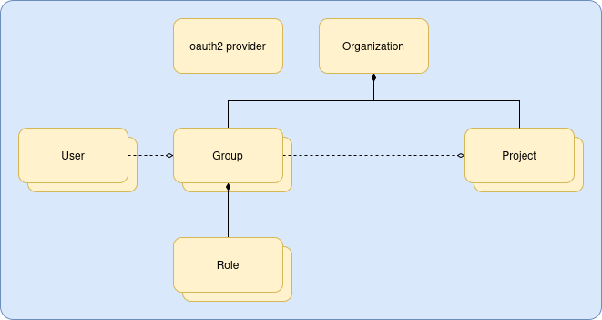
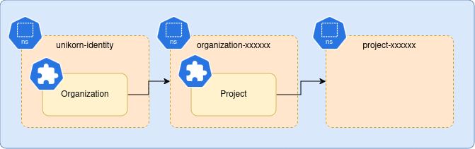

# Identity

Identity provides the platform's authentication, delegated identity, and centralized RBAC
services. It implements OAuth2/OIDC for built-in and self-contained deployments, can federate
external identity providers, and supplies the trust and authorization model used by other UNI
services.

## Developers

[Developer Hub](https://github.com/nscaledev/uni/blob/main/DEVELOPER.md)

## Package Documentation

Implementation-level package documentation lives in [pkg/README.md](./pkg/README.md).
Use that as the drill-down entry point for the service internals, especially for
authentication, RBAC, middleware, handlers, and controller/provisioner
behaviour.

## Architecture



Conceptually, the identity service is quite simple, but does feature some enterprise grade features, described in the following sections.

### Organizations

The top level resource type is an organization.
Organizations are named and limited by normal Kubernetes resource name semantics (i.e. a DNS label).
Like all resources they may have a description attached to provide verbose identification.

Organizations MAY define a domain e.g. `acme.com`.
In the built-in login flow this can be used to route a user to the correct upstream identity
provider based on their email address.

This remains a supported capability, but it is no longer the main production center of gravity.
The broader system direction is toward direct integration with third-party identity providers while
retaining identity's internal authorization and delegated-identity model.

### OAuth2 Providers

Identity includes built-in provider presets for common backends such as:

* Google Workspace
* Microsoft Entra
* GitHub

It can also be configured against other OIDC/OAuth2-compatible providers by supplying:

* An OIDC-compliant issuer endpoint
* A client ID
* A client secret

### Users

Users are a "global" resource that forms a unique record for a specific individual.
The intention going forward is to allow aggregation of different identifiers (e.g. email addresses) that map to a single place for identity and preference information to be stored.

The user record forms the core of security on the platform.
An end user cannot login without a corresponding user record.

The user record also contains OIDC session data.
When a user logs in, the authenticator creates or updates a session record for the user per OIDC
client. This facilitates token validation, revocation, single-use refresh tokens, and the
single-active session/token-chain model enforced by the service.

Users can exist in multiple states: `active`, `suspended` meaning they cannot login, or `pending`
meaning the user has been placed on administrative hold by a platform administrator.

### Organization Users

Organization users are simply organization scoped user records that reference a global user.
This allows users to be members of multiple organizations.

Like users, these can exist in `active` or `suspended` states allowing an organization administrator to remove access to that organization only.

Like users a login attempt without any corresponding organization user will be denied.
The exception to this rule is a platform administrator.

### Roles

Roles grant fine grain permissions to users that permit individual operations (create, read, update, delete) to individual API endpoints.

We define a number of default roles, but the system is intended to support broader role sets over
time, including finer-grained custom roles.

The `administrator` role allows broad access across an organization, it can edit organizations,
create groups and associate users and roles with them, create projects and associate groups with
them.
Administrator users can generally see all resources within the organization defined for other services, and manage them.

The `user` role cannot modify anything defined by the identity service, it's only allowed to discover organizations and projects its a member of.
Users SHOULD have additional permissions defined for external services, e.g. provisioning and management of compute infrastructure.

The `reader` is similar to the `user` but allows read only access, typically used by billing and auditing teams.

> [!NOTE]
> If you do define external 3rd party roles, you will be responsible for removing any references to them from groups on deletion.
> Failure to do so will result in dangling references, an inconsistency and an error condition.

### Groups

Every organization SHOULD have some groups, as they are the primary local delegation unit.
Groups define a set of organization users and service accounts that belong to them, and a set of
roles associated with that group.

### Projects

Projects provide workspaces for use by external services.
Users and service accounts participate in a project indirectly by associating the project with one
or more groups, therefore each project SHOULD have at least one group associated with it.

Like most other components, flexibility is built in by design, so a project can be shared with
multiple groups.

## Security

### OIDC Clients

Any compliant OIDC client library should be able to interact with the identity service, and passes the OpenID Connect Basic Conformance Suite.

It features service discovery for simple configuration, and the login hint extension for seamless
token refresh.

To enable a client, you will need to create an `oauth2client` resource in the identity service
namespace, featuring the client ID (must be unique, typically you can use `uuidgen` for this), and
an OIDC callback URI.

Optionally you can override the branding with a custom login and error URL callback too.
These are available on the `OAuth2Client` data type.
See the reference implementation [login](https://github.com/nscaledev/uni-ui/tree/main/src/routes/login) and [error](https://github.com/nscaledev/uni-ui/tree/main/src/routes/error) pages for the interface.

Once created, the `oauth2client` controller will generate a client secret in the resource status
that can be shared with the relaying party.

This built-in confidential-client flow is especially relevant for local, self-contained, or
development-oriented deployments. Production deployments may instead rely more heavily on
third-party identity providers while still using identity as the internal authorization and
delegated-identity service.

### Authentication

Authentication is handled through two primary paths:

* User to service: the caller presents a bearer token, identity validates it, and downstream RBAC
  is evaluated as that user or service account.
* Service to service: the caller authenticates with mTLS, service identity comes from the client
  certificate, and delegated principal context is propagated explicitly when a service acts on
  behalf of a user.

Identity keeps actor identity, delegated principal, and effective authority separate. When a
service acts on behalf of a principal, downstream authorization can be limited by the intersection
of service authority and principal authority.

Older service-to-service token issuance paths still exist for compatibility, but the preferred
model is direct mTLS plus delegated principal propagation.

### RBAC

The identity service provides centralized role based access control to the suite of services.
As described previously, roles can be arbitrary and apply to services outside of the identity service.

A role is composed of a set of arbitrary endpoint scopes, that typically define an API endpoint group e.g. `kubernetes:clusters` or `identity:projects`.
Within an endpoint scope is a set of permissions; `create`, `read`, `update` and `delete` (i.e. CRUD).

Endpoint scopes are grouped by identity scopes, `global` scopes affect all resources on the platform, `organization` scopes are limited to an organization and `project` scopes are limited to specific projects.

The API provides access to an access control list (ACL) which contains global scopes, organization scopes for the selected organization, and project scopes within that organization.

The ACL is used to:

* Control API access to endpoint resources.
* Drive UI views tailored to what actions the user can actually perform.

### Scoping

Some APIs e.g. listing Kubernetes clusters within an organization, are implicitly scoped.
These will return all clusters if you have global or organization scoped cluster read access, or only those resources that exist in projects you have cluster read access to.

## Integration with Other Services

By itself, the identity service doesn't offer much functionality beyond simple OIDC authentication flows.
Other services are responsible for provisioning and managing actual resources.

For historical reasons, the current `v1` model still uses organization and project namespaces as
part of resource placement and lifecycle coordination.
This allowed projects and resources within them to accept any name the end user wished to use.
Now we use random UUIDs to name resources and allow the actual human readable names to be mutable
via a label.



There is still some utility to having the namespaces in place as we can use them as selectors when
listing resources, but this is current operational reality rather than the preferred long-term
architecture.

The identity service manages all this for you automatically.
Unique namespace names are automatically generated by the platform, and organization and project resources record this in their status for easy navigation.

Other services, e.g. the Kubernetes service can then consume the project namespace by having their
custom resources residing in there, separating them from other projects and other organizations.

## Installation

Identity is the first thing you should install, as it provides authentication services for other services, or can be used as a standalone identity provider.

### Prerequisites

* A domain name (`acme.com` for this tutorial)
* [external-dns](https://github.com/kubernetes-sigs/external-dns) configured on your Kubernetes cluster to listen to `Ingress` resources.
* [cert-manager](https://cert-manager.io/) configured on your Kubernetes cluster
* A cert-manager `ClusterIssuer` configured for use, typically Let's Encrypt, but you can use a self signed CA.

```shell
DOMAIN=acme.com
```

### Configuring an OIDC Backend

First you will need to calculate what the OIDC callback will be.
Choose a public DNS name from your domain e.g. `identity.acme.com`.
The OIDC callback URI will be `https://identity.acme.com/oidc/callback`:

```shell
IDENTITY_HOST=identity.${DOMAIN}
IDENTITY_OIDC_CALLBACK=https://${IDENTITY_HOST}/oidc/callback
```

Most OIDC providers will be configured by creating an "Application".
This will require the callback URI to be registered as trusted.
The identity provider will give you an issuer or discovery endpoint, client ID and client secret for the following steps.

> [!NOTE]
> Built-in presets are currently provided for Google Identity, Microsoft Entra, and GitHub.
> Other OIDC/OAuth2-compatible providers can also be configured directly by supplying issuer and
> client credentials.

### Installing the Service with Helm

You must first define where the UI will live in order to configure that OIDC callback and setup CORS:

```shell
UI_HOST=console.${DOMAIN}
UI_ORIGIN=https://${UI_HOST}
UI_OIDC_CALLBACK=${UI_ORIGIN}/oauth2/callback
UI_LOGIN_CALLBACK=${UI_ORIGIN}/login
UI_ERROR_CALLBACK=${UI_ORIGIN}/error
UI_CLIENT_ID=$(uuidgen)
```

Create a basic `values.yaml` file:

```yaml
host: ${IDENTITY_HOST}
cors:
  allowOrigin:
  - ${UI_ORIGIN}
ingress:
  clusterIssuer: letsencrypt-production
  externalDns: true
clients:
  unikorn-ui:
    redirectURI: ${UI_OIDC_CALLBACK}
    homeURI: ${UI_ORIGIN}
    loginURI: ${UI_LOGIN_CALLBACK} # (optional)
    errorURL: ${UI_ERROR_CALLBACK}
providers:
  google-identity:
    description: Google Identity
    type: google # (must be either google or microsoft)
    issuer: https://accounts.google.com
    clientID: <string> # provided by the identity provider, see above
    clientSecret: <string> # provider by the identity provider, see above
platformAdministrators:
  subjects:
  - wile.e.coyote@acme.com
systemAccounts:
  unikorn-kubernetes: infra-manager-service
  unikorn-compute: infra-manager-service
```

Install the Helm repository:

```shell
helm repo add uni-identity https://nscaledev.github.io/uni-identity
```

Deploy:

```shell
helm upgrade --install --namespace unikorn-identity uni-identity/uni-identity -f values.yaml
```

### Installing the Management Plugin

Download the following [artefacts](https://github.com/nscaledev/kubectl-uni/releases) and install them in your path:

* `kubectl-uni`
* `kubectl_complete-uni`

### Initial User Setup

Typically your deployment will have a small select few engineers who are able to see and do
everything, including creating organizations.

In the earlier `values.yaml` manifest, the following section was defined:

```yaml
platformAdministrators:
  subjects:
  - wile.e.coyote@acme.com
```

This forms an implicit mapping from a user to a special role that grants access to all-the-things.

In order to actually login, you will need a user account created:

```shell
kubectl uni create user \
     --namespace unikorn-identity \
     --user wile.e.coyote@acme.com
```

And at least one organization:

```shell
kubectl uni create organization \
    --namespace unikorn-identity \
    --name looney-tunes
```

If your user's email address can be authenticated by any of the supported OIDC integrations, that's all you need to do, otherwise read on...

### 3rd Party Service Integration

When using an integration such as the [Kubernetes Service](https://github.com/nscaledev/uni-kubernetes)
you will need to configure system-account to RBAC mappings.
3rd party services usually act on behalf of a user, and as such need elevated global privileges, so
as to avoid giving the end user permission to sensitive endpoints.

In the earlier `values.yaml` manifest, the following section was defined:

```yaml
systemAccounts:
  unikorn-kubernetes: infra-manager-service
  unikorn-compute: infra-manager-service
```

In very simple terms, a 3rd party service authenticates to other services using mTLS.
The X.509 certificate must be signed by the trusted client CA (typically issued by the
`unikorn-client-issuer` managed by cert-manager).
The X.509 Common Name (CN) encoded in the certificate is the key to the system-account mapping e.g.
`unikorn-kubernetes`.
The mapped value references a role name that is either installed by default, or created
specifically for your service.

#### 3rd Party User RBAC

If you are defining your own resources then they will need roles to allow end users access to the those APIs.

The recommended way to do this is:

* Create any end-user roles in your 3rd party Helm deployment and ensure they are created in the same namespace as the Identity service.
  * These will automatically be picked up and exposed for consumption in organization groups.
* Create any platform-admin roles in your 3rd party Helm deployment as above...
  * Ensure the role is marked as protected to prevent it being exposed via the API, otherwise you may inadvertently end up allowing users to see into other organizations.
  * These can be granted to platform administrators via the `platformAdministrators.roles` list in the Identity Helm chart.

## Integration Testing

A KinD-based integration test suite validates the full deployment end-to-end: Helm chart
correctness, RBAC enforcement via real HTTP requests, and controller reconciliation. It runs
automatically on every pull request via `.github/workflows/integration.yaml`.

To run locally before opening a PR:

```sh
# One-time cluster setup
make kind-cluster integration-infra

# Deploy, create fixtures, run tests
make integration-install integration-fixtures test-api-ci
```

See [`docs/integration-testing.md`](docs/integration-testing.md) for the full local developer
guide, including prerequisites, iterative workflows, and troubleshooting.

## Contract Testing

uni-identity acts as a provider for consumer services like uni-region. Contract tests verify that uni-identity satisfies the expectations defined by consumers.

### Running Provider Verification Tests

Provider verification tests check that uni-identity meets the contracts published by consumers (like uni-region) to the Pact Broker.

Run verification against pacts from the Pact Broker:
```bash
make test-contracts-provider
```

Run verification against a local pact file:
```bash
make test-contracts-provider-local PACT_FILE=/path/to/pact.json
```

Run with verbose output:
```bash
make test-contracts-provider-verbose
```

### Provider Verification in CI

Contract verification runs automatically in CI:
- **Pull Requests**: Verifies contracts and publishes verification results to Pact Broker

### Automated Provider Verification (Webhook)

The repository includes a webhook-triggered workflow (`.github/workflows/pact-verification.yaml`) that automatically verifies contracts when consumers publish new pacts.

**How it works:**
1. Consumer (e.g., uni-region) publishes a new pact to Pact Broker
2. Pact Broker webhook triggers this repository's GitHub Actions workflow
3. Provider verification runs automatically against the new contract
4. Results are published back to Pact Broker
5. Consumer's `can-i-deploy` check can now validate compatibility

**Setup:**
The webhook is configured in the Pact Broker by the consumer service. See the consumer's README for webhook setup instructions.

**Workflow trigger:**
```yaml
on:
  repository_dispatch:
    types: [pact_verification]
```

This workflow receives metadata about which pact to verify and runs `make test-contracts-provider-ci` to verify and publish results.

### Writing Provider Tests

Provider tests are located in `test/contracts/provider/{consumer}/`. Each consumer has:
- `verify_test.go` - Main test setup and verification
- `states.go` - State handlers for setting up test data
- `middleware.go` - Test-specific middleware (e.g., mock authentication)

**State Handlers:**

State handlers set up the required state for each test:
```go
func (sm *StateManager) HandleOrganizationWithGlobalPermission(ctx context.Context, setup bool, params map[string]interface{}) error {
    orgID := getStringParam(params, "organizationID", "test-org-123")

    if setup {
        // Set up organization with global permissions
        sm.organizationStates[orgID] = OrganizationState{
            ID:        orgID,
            HasGlobal: true,
        }
    } else {
        // Clean up
        delete(sm.organizationStates, orgID)
    }

    return nil
}
```

### Emergency Escape Hatch

In exceptional circumstances (e.g. a hotfix that must merge before contract tests can be updated), you can skip contract tests for a single PR using the `skip-contract-tests` label.

**Behaviour:**

| Scenario | `ProviderContractVerification` | `CanIDeploy` |
|---|---|---|
| Label absent | Runs normally | Runs if verification passes |
| Label present | Skipped (neutral) | Skipped (neutral) |
| Verification fails | Failed | Skipped |

Skipped jobs are treated as neutral by GitHub branch protection, so required status checks remain satisfied.
The label application is fully auditable in the PR timeline.

**When to use:** Only when contract tests need updating but cannot block a hotfix. Remove the label once the pact is updated.

**One-time setup** — create the label in GitHub → Settings → Labels:

| Field | Value |
|---|---|
| Name | `skip-contract-tests` |
| Description | `Use only when tests need updating but can't block a hotfix.` |
| Color | Any distinctive colour (e.g. `#e4e669`) |

## What Next?

As you've noted, objects are named based on UUIDs, therefore administration is somewhat counter intuitive, but it does allow names to be mutable.
For ease of management we recommend installing the [UI](https://github.com/nscaledev/uni-ui)
